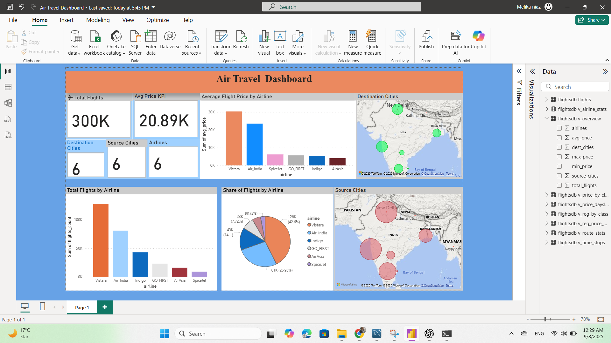

# ✈️ Air Travel Dashboard

This project demonstrates an **end-to-end workflow**:  
from loading and preparing airline flight data in **MySQL**,  
to creating reusable **SQL views**, and finally building an interactive **Power BI dashboard**.

---

## 🔹 Project Workflow

### 1. Data Preparation (MySQL)
- Imported a CSV dataset of flights into MySQL.  
- Created the `flightsdb` schema and loaded raw flight records.  
- Performed exploratory queries:
  - Distinct airlines, source and destination cities.  
  - Flight classes, stops distribution, and price ranges.  
- Built several **SQL views** for analysis:  
  - `v_overview` – dataset overview.  
  - `v_airline_stats` – flights count and pricing per airline.  
  - `v_price_by_class` – price trends by travel class.  
  - `v_route_stats` – flights per route.  
  - `v_time_stops` – stops and timings.  
  - `v_reg_price_daysleft` – regression (Price ~ Days_Left).  

### 2. Data Visualization (Power BI)
- Connected Power BI directly to MySQL (`flightsdb`).  
- Imported the **raw table** and the **SQL views**.  
- Designed a dashboard with:  
  - **KPIs**: Total Flights, Avg Ticket Price (€), Distinct Airlines, Source & Destination Cities.  
  - **Bar Chart**: Total Flights by Airline.  
  - **Pie Chart**: Airline Market Share.  
  - **Map**: Geographical distribution of flights (Source vs Destination).  
  - **Bar Chart**: Average Ticket Price per Airline.  

---

## 📊 Dashboard Preview

---

## 🚀 Tools Used
- **MySQL 8.0** – database, queries, and views  
- **Power BI Desktop** – dashboard and visualization  
- **GitHub** – version control and portfolio hosting  

---

## ✨ Key Insights
- Identified airlines with the highest number of flights.  
- Compared **average ticket prices (€)** across airlines.  
- Visualized market share of airlines.  
- Highlighted flight networks (source & destination cities).  

---

📌 This project shows my ability to work across the full **data pipeline**:  
**SQL for data engineering → Power BI for business intelligence.**

---

## 📂 Repository Structure
